# Architecture — OTA Search Ingestion Pipeline

## Problem statement

Lighthouse partners with an online travel agency (OTA) that sends hotel search events via HTTP POST. The goal is to ingest, store, and expose per-city trend metrics in the **Market Insight** product:

- Popularity of arrival dates (time series)
- Top searcher countries (% share, average length of stay)
- Length-of-stay distribution (LOS1, LOS2, LOS3, LOS4–7, LOS8–14)

**Volume:** 100 req/s, ~1 KB/request, ~260 GB/month raw.

---

## High-level architecture

```mermaid
flowchart LR
  subgraph ingest [Ingestion]
    OTA[OTA Partner]
    LB[Cloud Load Balancer]
    API[Ingestion API on Cloud Run]
    OTA -->|HTTPS POST| LB --> API
  end

  subgraph stream [Streaming Buffer]
    PS[Pub/Sub topic]
    DLQ[Pub/Sub dead-letter topic]
    API -->|publish validated envelope| PS
    API -->|sync reject| DLQ
  end

  subgraph process [Processing]
    DF[Dataflow Python streaming job]
    PS --> DF
    DF -->|invalid| DLQ
    DF -->|valid JSON| GCS[GCS bronze bucket]
    DF -->|valid rows| BQBronze[BigQuery bronze table]
  end

  subgraph transform [Transform and Serve]
    AF[Airflow Composer]
    DBT[dbt models and tests]
    BQSilver[BigQuery silver]
    BQGold[BigQuery gold aggregates]
    SRV[Market Insight API on GKE]
    GCS --> AF
    BQBronze --> AF --> DBT
    DBT --> BQSilver --> BQGold
    BQGold --> SRV
  end

  subgraph ops [Ops and Governance]
    MON[Cloud Monitoring + Grafana]
    SODA[Soda checks + dbt tests]
    ATLAN[Atlan lineage and catalog]
    TF[Terraform state in GCS]
  end
```



---

## Lighthouse-aligned technology choices

| Layer | Technology | Why |
|---|---|---|
| Ingestion | FastAPI on Cloud Run | Python-native, auto-scales, low ops for 100 req/s |
| Buffer | Pub/Sub | Decouples ingestion from processing; absorbs backpressure |
| Streaming landing | Dataflow (Beam Python SDK) | Lighthouse standard for GCP streaming; Flex Templates |
| Data warehouse | BigQuery (EU) | Lighthouse primary DWH; partition + cluster for cost |
| Transforms | dbt | Lighthouse standard for silver/gold modeling and tests |
| Orchestration | Airflow (Composer) + Cosmos | Lighthouse uses Cosmos for Airflow ↔ dbt integration |
| Data quality | Soda Core + dbt tests | Lighthouse-listed governance tooling |
| Governance | Atlan | Auto-ingests dbt manifest for lineage |
| Infrastructure | Terraform | Lighthouse IaC standard; GCS remote state |
| CI/CD | GitLab CI | Lighthouse preference |
| Product | GKE (existing Market Insight) | Integrate with existing product backend |

---

## Component details

### 1. Ingestion API (Cloud Run + FastAPI)

- **Endpoint:** `POST /v1/searches`
- **Auth:** API key in header + partner IP allowlist
- **Validation:** JSON Schema + Python business rules (sync, < 10 ms)
- **Response:** `202 Accepted` (valid), `400 Bad Request` (invalid), `429 Too Many Requests`
- **Publish:** Valid events to Pub/Sub with attributes (`ingestion_time`, `partner_id`, `schema_version`)

**Why Pub/Sub instead of direct BigQuery write?**
- Decouples write latency from ingestion response time
- Enables replay and multiple consumers (bronze landing, audit)
- Absorbs traffic spikes without dropping partner requests

### 2. Dataflow streaming job (bronze landing)

- **Input:** Pub/Sub subscription
- **Processing:** Parse JSON, compute `dedup_key`, assign `event_id`, light schema check
- **Output:** BigQuery `raw_ota_searches` + GCS raw archive (JSON lines)
- **Errors:** Invalid records → DLQ topic → quarantine BigQuery table
- **Deploy:** Dataflow Flex Template via Terraform + Airflow health check

### 3. Medallion data model (BigQuery)

| Layer | Dataset | Table | Materialization |
|---|---|---|---|
| Bronze | `ota_bronze` | `raw_ota_searches` | Append-only, partitioned by `DATE(search_timestamp)` |
| Silver | `ota_silver` | `searches_enriched` | Incremental dbt model, deduped, city resolved |
| Gold | `ota_gold` | `gold_arrival_date_popularity` | Table, refreshed every 15 min |
| Gold | `ota_gold` | `gold_country_trends` | Table, refreshed every 15 min |
| Gold | `ota_gold` | `gold_los_distribution` | Table, refreshed every 15 min |

### 4. dbt transforms

**Silver (`searches_enriched`):**
- Parse bronze JSON fields
- Join `hotel_id` → `city` via `dim_hotels`
- Normalize `user_country` to ISO-3166
- Validate LOS consistency; exclude invalid rows
- Derive `los_bucket` (1, 2, 3, 4-7, 8-14)

**Gold models map 1:1 to Market Insight charts** — see `dbt/models/gold/`.

### 5. Orchestration (Airflow + Cosmos)

```
ota_search_pipeline DAG (every 15 min):
  1. check_dataflow_job_health
  2. dbt_run_silver   (Cosmos DbtTaskGroup)
  3. dbt_run_gold     (Cosmos DbtTaskGroup)
  4. soda_scan_silver
  5. expire_bronze_partitions (> 90 days)
```

### 6. Product serving (GKE)

Gold tables are queried by the existing Market Insight backend. No new read API is introduced. Product team consumes:

- `gold_arrival_date_popularity` → search level chart
- `gold_country_trends` → top countries panel
- `gold_los_distribution` → LOS distribution chart

---

## Cross-cutting concerns

### Error handling

| Failure | Handling |
|---|---|
| Invalid JSON at edge | `400` to partner; optional DLQ for audit |
| Pub/Sub publish failure | Retry with backoff; alert if sustained |
| Dataflow processing error | DLQ + Cloud Monitoring alert (> 1% error rate) |
| dbt test failure | Block gold refresh; alert Data Products team |
| Unknown hotel_id | `city = NULL`; Soda check flags if rate > 0.1% |

### Data privacy (GDPR)

- No user-level identifiers in payload
- Product exposes city-level aggregates only
- EU data residency (`europe-west1`)
- Bronze TTL 90 days; DPA with OTA partner

### Performance

- BigQuery partition pruning on `search_timestamp`
- Incremental dbt models (process only new bronze partitions)
- Pre-aggregated gold tables (no scan of bronze at query time)
- Dataflow autoscaling (2–4 workers for 100 req/s)

### Observability (SLIs)

| SLI | Target |
|---|---|
| Ingestion API p99 latency | < 200 ms |
| End-to-end freshness (event → gold) | < 20 min |
| Validation error rate | < 0.5% |
| dbt run success rate | > 99% |
| DLQ rate | < 0.1% |

---

## Lambda-inspired layering

| Layer | Component | Latency |
|---|---|---|
| **Speed** | Dataflow → bronze | Seconds |
| **Batch** | Airflow + dbt → silver/gold | 15 min |
| **Serving** | GKE Market Insight API | Reads pre-aggregated gold |

---

## MVP phasing

| Phase | Scope | Timeline |
|---|---|---|
| **Phase 1** | FastAPI → Pub/Sub → GCS → BQ load → dbt → Market Insight | 2–4 weeks |
| **Phase 2** | Dataflow streaming, DLQ, Soda monitoring | +2 weeks |
| **Phase 3** | Atlan lineage, multi-partner schema registry, CUD | Ongoing |

---

## Repository layout

See project root for implementation artifacts:

- `validation/` — edge validation (Python)
- `streaming/` — Dataflow bronze landing pipeline
- `dbt/` — warehouse models and tests
- `soda/` — warehouse data quality checks
- `airflow/` — orchestration DAG
- `infra/` — Terraform modules
- `docs/` — assumptions, costs, Q&A
