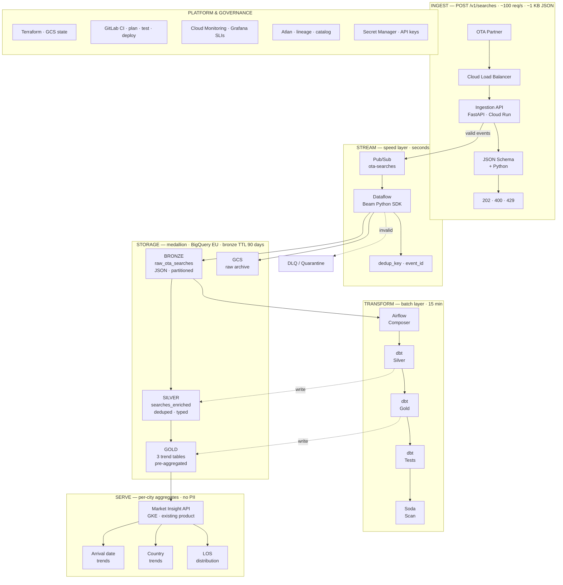

# Architecture — OTA Search Ingestion Pipeline

## Problem statement

Lighthouse partners with an online travel agency (OTA) that sends hotel search events via HTTP POST. The goal is to ingest, store, and expose per-city trend metrics in the **Market Insight** product:

- Popularity of arrival dates (time series)
- Top searcher countries (% share, average length of stay)
- Length-of-stay distribution (LOS1, LOS2, LOS3, LOS4–7, LOS8–14)

**Volume:** 100 req/s, ~1 KB/request, ~260 GB/month raw.

---

## High-level architecture

### Pipeline schematic

End-to-end flow by layer (ingest → stream → storage → transform → serve). Renders in GitHub and Markdown preview; a static PNG copy lives in [`docs/assets/pipeline_schematic.png`](assets/pipeline_schematic.png).



<details>
<summary>Static diagram (for slides / offline viewing)</summary>


</details>

### Architecture overview — step by step

The linear diagram [`01_architecture_overview.png`](../presentation/assets/01_architecture_overview.png) is a simplified left-to-right view of the same pipeline. Each box is explained below.


| Step | Component | Role | What happens here |
|---|---|---|---|
| 1 | **OTA Partner** | External data source | Sends one hotel search event per `POST` (~100 req/s, ~1 KB JSON). Example partners: booking.com, trivago. Retries on timeout — we handle duplicates downstream. |
| 2 | **Cloud Load Balancer** | Public entry point (GCP) | Sits in front of Cloud Run and gives the partner a **stable HTTPS URL** and TLS termination. Distributes traffic across healthy Cloud Run instances, enforces **partner IP allowlisting** at the edge, and can apply WAF / DDoS protection. Without it, the partner would need to target individual Cloud Run URLs that change on redeploy. *Not used in the local demo — there the partner hits `localhost:8080` directly.* |
| 3 | **FastAPI · Cloud Run** | Ingestion API | Receives `POST /v1/searches`, validates the payload (JSON Schema + Python business rules in < 10 ms), checks the API key, and returns `202 Accepted` or `400 Bad Request`. Valid events are published to Pub/Sub. Cloud Run auto-scales with traffic and is serverless — no cluster to manage for 100 req/s. Code: `services/ingestion_api/`. |
| 4 | **Pub/Sub** | Streaming buffer | Durable message queue between ingestion and storage. Decouples the API response time from BigQuery write speed, absorbs traffic spikes, and allows replay if Dataflow or dbt fails. Retains messages up to 7 days. |
| ↳ | **DLQ** (dashed branch) | Dead-letter queue | Messages that fail processing repeatedly (malformed after edge pass, Dataflow errors) route here instead of blocking the pipeline. Stored for audit and manual replay — not silently dropped. |
| 5 | **Dataflow · Beam Python** | Streaming landing (speed layer) | Reads Pub/Sub, parses JSON, assigns `event_id`, computes `dedup_key`, and writes valid rows to bronze within **seconds**. Lighthouse standard for GCP streaming ingest. Code: `streaming/bronze_landing.py`. |
| 6 | **BigQuery Bronze + GCS** | Raw storage (medallion) | **BigQuery** `raw_ota_searches` stores structured rows (full JSON + metadata, append-only, 90-day TTL). **GCS** holds an immutable JSON-lines archive for disaster recovery and reprocessing. Bronze is the audit trail — nothing is discarded before landing here. |
| 7 | **Airflow + dbt** | Batch transform (15 min) | **Airflow (Composer)** orchestrates the pipeline every 15 minutes: trigger dbt, run tests, Soda scans, partition expiry. **dbt** owns all SQL transforms — silver enrichment, gold aggregations, and data tests. Separates orchestration from transform logic. |
| 8 | **BigQuery Silver / Gold** | Curated storage (medallion) | **Silver** (`searches_enriched`): typed, deduped events with city resolved and country normalized. **Gold** (3 tables): pre-aggregated per-city metrics for the dashboard. Gold is ~5 GB total vs ~260 GB/month bronze — dashboard queries never scan raw events. |
| 9 | **Market Insight · GKE** | Product serving | Existing Lighthouse product backend on Kubernetes reads gold tables and serves per-city trends (arrival dates, countries, LOS). No greenfield read API in production — we integrate with what already exists. Local stand-in: `services/market_insight_api/`. |

**How this relates to the swim-lane schematic above:** the overview diagram collapses validation, ops, and the three gold tables into fewer boxes for presentation clarity. The detailed schematic shows the same flow with swim lanes (INGEST → STREAM → STORAGE → TRANSFORM → SERVE) and the platform column (Terraform, GitLab CI, Atlan, etc.).

---

## Lighthouse-aligned technology choices

| Layer | Technology | Why |
|---|---|---|
| Ingestion | FastAPI on Cloud Run | Python-native, auto-scales, low ops for 100 req/s |
| Buffer | Pub/Sub | Decouples ingestion from processing; absorbs backpressure |
| Streaming landing | Dataflow (Beam Python SDK) | Lighthouse standard for GCP streaming; Flex Templates |
| Data warehouse | BigQuery (EU) | Lighthouse primary DWH; partition + cluster for cost |
| Transforms | dbt | Lighthouse standard for silver/gold modeling and tests |
| Orchestration | Airflow (Composer) + Cosmos | Lighthouse uses Cosmos for Airflow ↔ dbt integration |
| Data quality | Soda Core + dbt tests | Lighthouse-listed governance tooling |
| Governance | Atlan | Auto-ingests dbt manifest for lineage |
| Infrastructure | Terraform | Lighthouse IaC standard; GCS remote state |
| CI/CD | GitLab CI | Lighthouse preference |
| Product | GKE (existing Market Insight) | Integrate with existing product backend |

---

## Component details

### 1. Ingestion API (Cloud Run + FastAPI)

- **Endpoint:** `POST /v1/searches`
- **Auth:** API key in header + partner IP allowlist
- **Validation:** JSON Schema + Python business rules (sync, < 10 ms)
- **Response:** `202 Accepted` (valid), `400 Bad Request` (invalid), `429 Too Many Requests`
- **Publish:** Valid events to Pub/Sub with attributes (`ingestion_time`, `partner_id`, `schema_version`)

**Why Pub/Sub instead of direct BigQuery write?**
- Decouples write latency from ingestion response time
- Enables replay and multiple consumers (bronze landing, audit)
- Absorbs traffic spikes without dropping partner requests

### 2. Dataflow streaming job (bronze landing)

- **Input:** Pub/Sub subscription
- **Processing:** Parse JSON, compute `dedup_key`, assign `event_id`, light schema check
- **Output:** BigQuery `raw_ota_searches` + GCS raw archive (JSON lines)
- **Errors:** Invalid records → DLQ topic → quarantine BigQuery table
- **Deploy:** Dataflow Flex Template via Terraform + Airflow health check

### 3. Medallion data model (BigQuery)

| Layer | Dataset | Table | Materialization |
|---|---|---|---|
| Bronze | `ota_bronze` | `raw_ota_searches` | Append-only, partitioned by `DATE(search_timestamp)` |
| Silver | `ota_silver` | `searches_enriched` | Incremental dbt model, deduped, city resolved |
| Gold | `ota_gold` | `gold_arrival_date_popularity` | Table, refreshed every 15 min |
| Gold | `ota_gold` | `gold_country_trends` | Table, refreshed every 15 min |
| Gold | `ota_gold` | `gold_los_distribution` | Table, refreshed every 15 min |

### 4. dbt transforms

**Silver (`searches_enriched`):**
- Parse bronze JSON fields
- Join `hotel_id` → `city` via `dim_hotels`
- Normalize `user_country` to ISO-3166
- Validate LOS consistency; exclude invalid rows
- Derive `los_bucket` (1, 2, 3, 4-7, 8-14)

**Gold models map 1:1 to Market Insight charts** — see `dbt/models/gold/`.

### 5. Orchestration (Airflow + Cosmos)

```
ota_search_pipeline DAG (every 15 min):
  1. check_dataflow_job_health
  2. dbt_run_silver   (Cosmos DbtTaskGroup)
  3. dbt_run_gold     (Cosmos DbtTaskGroup)
  4. soda_scan_silver
  5. expire_bronze_partitions (> 90 days)
```

### 6. Product serving (GKE)

Gold tables are queried by the existing Market Insight backend. No new read API is introduced. Product team consumes:

- `gold_arrival_date_popularity` → search level chart
- `gold_country_trends` → top countries panel
- `gold_los_distribution` → LOS distribution chart

---

## Cross-cutting concerns

### Error handling

| Failure | Handling |
|---|---|
| Invalid JSON at edge | `400` to partner; optional DLQ for audit |
| Pub/Sub publish failure | Retry with backoff; alert if sustained |
| Dataflow processing error | DLQ + Cloud Monitoring alert (> 1% error rate) |
| dbt test failure | Block gold refresh; alert Data Products team |
| Unknown hotel_id | `city = NULL`; Soda check flags if rate > 0.1% |

### Data privacy (GDPR)

- No user-level identifiers in payload
- Product exposes city-level aggregates only
- EU data residency (`europe-west1`)
- Bronze TTL 90 days; DPA with OTA partner

### Performance

- BigQuery partition pruning on `search_timestamp`
- Incremental dbt models (process only new bronze partitions)
- Pre-aggregated gold tables (no scan of bronze at query time)
- Dataflow autoscaling (2–4 workers for 100 req/s)

### Observability (SLIs)

| SLI | Target |
|---|---|
| Ingestion API p99 latency | < 200 ms |
| End-to-end freshness (event → gold) | < 20 min |
| Validation error rate | < 0.5% |
| dbt run success rate | > 99% |
| DLQ rate | < 0.1% |

---

## Lambda-inspired layering

| Layer | Component | Latency |
|---|---|---|
| **Speed** | Dataflow → bronze | Seconds |
| **Batch** | Airflow + dbt → silver/gold | 15 min |
| **Serving** | GKE Market Insight API | Reads pre-aggregated gold |

---

## MVP phasing

| Phase | Scope | Timeline |
|---|---|---|
| **Phase 1** | FastAPI → Pub/Sub → GCS → BQ load → dbt → Market Insight | 2–4 weeks |
| **Phase 2** | Dataflow streaming, DLQ, Soda monitoring | +2 weeks |
| **Phase 3** | Atlan lineage, multi-partner schema registry, CUD | Ongoing |

---

## Repository layout

See project root for implementation artifacts:

- `validation/` — edge validation (Python)
- `streaming/` — Dataflow bronze landing pipeline
- `dbt/` — warehouse models and tests
- `soda/` — warehouse data quality checks
- `airflow/` — orchestration DAG
- `infra/` — Terraform modules
- `docs/` — assumptions, costs, Q&A
