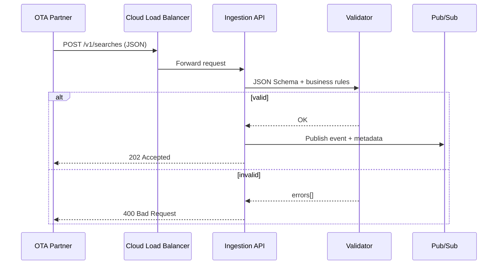
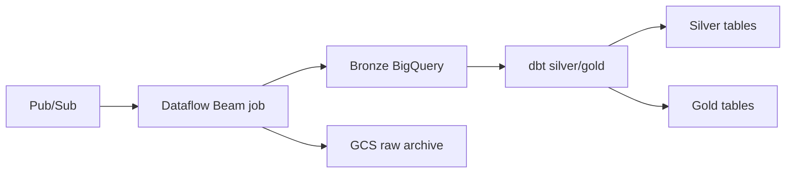

# 1. Receive, Store, and Expose Data

**Case requirement:** *Design a system that is able to receive, store and expose this data to our application.*

This document describes how the OTA search pipeline fulfils all three responsibilities end-to-end.

---

## Overview

The system implements a **Lambda-inspired architecture** aligned with Lighthouse's stack:

| Stage | Responsibility | Component |
|---|---|---|
| **Receive** | Accept HTTP POST events from OTA partner | FastAPI on Cloud Run |
| **Store** | Persist raw and transformed data | Pub/Sub → Dataflow → BigQuery (GCS archive) |
| **Expose** | Serve trend metrics to Market Insight | Gold tables → GKE backend / read API |

Locally, the same flow runs with DuckDB instead of BigQuery — proving the design works without GCP.

---

## 1. Receive

### Inbound contract

- **Protocol:** HTTPS `POST /v1/searches`
- **Volume:** 100 req/s sustained (~8.6M events/day)
- **Payload:** ~1 KB JSON per hotel search event
- **Authentication:** API key header (`X-API-Key`) + partner IP allowlist (production)

### Implementation

| Artifact | Path |
|---|---|
| Ingestion API | [`services/ingestion_api/main.py`](../../services/ingestion_api/main.py) |
| JSON Schema | [`schemas/ota_search_v1.json`](../../schemas/ota_search_v1.json) |
| Python validator | [`validation/validate_search_event.py`](../../validation/validate_search_event.py) |

### Receive flow



### Response codes

| Code | Meaning | Action |
|---|---|---|
| `202 Accepted` | Event validated and queued | Partner can forget (at-least-once retries handled downstream) |
| `400 Bad Request` | Validation failed | Partner must fix payload |
| `401 Unauthorized` | Invalid API key | Partner must fix credentials |
| `429 Too Many Requests` | Rate limit exceeded | Partner should backoff |
| `413 Payload Too Large` | Body > 2 KB | Partner must reduce payload |

### Why not write directly to the warehouse?

Pub/Sub decouples ingestion latency from storage throughput:

- API responds in < 200 ms regardless of BigQuery write speed
- Events can be replayed if Dataflow or dbt fails
- Multiple consumers can read the same stream (bronze landing, audit, future real-time features)

---

## 2. Store

### Medallion architecture (BigQuery)

| Layer | Dataset | Table | Content |
|---|---|---|---|
| **Bronze** | `ota_bronze` | `raw_ota_searches` | Full JSON payload + metadata (`event_id`, `dedup_key`, `ingestion_time`) |
| **Silver** | `ota_silver` | `searches_enriched` | Typed, deduped, city resolved, country normalized |
| **Gold** | `ota_gold` | 3 trend tables | Pre-aggregated metrics for Market Insight charts |

### Storage flow (GCP)



| Artifact | Path |
|---|---|
| Dataflow bronze landing | [`streaming/bronze_landing.py`](../../streaming/bronze_landing.py) |
| dbt bronze staging | [`dbt/models/bronze/stg_ota_searches.sql`](../../dbt/models/bronze/stg_ota_searches.sql) |
| dbt silver | [`dbt/models/silver/searches_enriched.sql`](../../dbt/models/silver/searches_enriched.sql) |
| Terraform BigQuery module | [`infra/modules/bigquery/`](../../infra/modules/bigquery/) |

### Bronze record schema

Each stored event includes:

| Field | Purpose |
|---|---|
| `event_id` | Unique UUID assigned at ingestion |
| `dedup_key` | SHA-256 hash for retry deduplication |
| `ingestion_time` | When Lighthouse received the event |
| `partner_id` | Which OTA partner sent it |
| `schema_version` | Payload schema version (`v1`) |
| `payload` | Full original JSON |

### Local storage (demonstrable)

| Artifact | Path |
|---|---|
| Bronze writer | [`pipeline/bronze_store.py`](../../pipeline/bronze_store.py) |
| DuckDB transforms | [`pipeline/transforms.py`](../../pipeline/transforms.py) |
| Database file | `data/warehouse.duckdb` (created at runtime) |

### Retention

- **Bronze:** 90-day partition TTL (reprocessing window)
- **Gold:** Retained indefinitely (small, pre-aggregated)

---

## 3. Expose

### Product integration

Gold tables are consumed by the **Market Insight** product (existing GKE backend). The read layer queries pre-aggregated gold tables — never scanning bronze at request time.

### API endpoints

| Endpoint | Purpose |
|---|---|
| `GET /cities` | List cities with available trend data |
| `GET /cities/{city}/trends` | All three trend datasets for a city |
| `GET /cities/{city}/trends/arrival-dates` | Arrival date popularity only |
| `GET /cities/{city}/trends/countries` | Country trends only |
| `GET /cities/{city}/trends/los-distribution` | LOS distribution only |

### Implementation

| Artifact | Path |
|---|---|
| Market Insight read API | [`services/market_insight_api/main.py`](../../services/market_insight_api/main.py) |
| Gold models | [`dbt/models/gold/`](../../dbt/models/gold/) |

### Example response

```bash
curl http://localhost:8081/cities/New%20York/trends
```

```json
{
  "city": "New York",
  "arrival_date_popularity": [
    {"arrival_date": "2022-03-01", "search_date": "2022-01-24", "search_count": 1}
  ],
  "country_trends": [
    {"user_country": "Belgium", "pct_of_total": 100.0, "avg_los": 4.0}
  ],
  "los_distribution": [
    {"los_bucket": "4-7", "search_count": 1, "pct_of_total": 100.0}
  ]
}
```

---

## End-to-end latency

| Stage | Target latency |
|---|---|
| Receive (API → Pub/Sub) | < 200 ms p99 |
| Store (Pub/Sub → bronze) | < 5 s (Dataflow streaming) |
| Transform (bronze → gold) | < 15 min (Airflow + dbt schedule) |
| Expose (gold → API response) | < 500 ms p95 |

---

## How to run locally

```bash
pip install -r requirements.txt
uvicorn services.ingestion_api.main:app --port 8080      # receive
uvicorn services.market_insight_api.main:app --port 8081  # expose
python scripts/demo.py                                    # end-to-end demo
```

Or run tests: `pytest validation/ tests/ -v` (17 tests, full receive → store → expose flow).

---

## Design decisions summary

| Decision | Rationale |
|---|---|
| Pub/Sub buffer | Decoupling, replay, backpressure absorption |
| Medallion (bronze/silver/gold) | Clear data quality boundaries; gold optimized for reads |
| Pre-aggregated gold | Dashboard queries scan ~5 GB, not 260 GB/month bronze |
| Fast sync validation at edge | Fail fast for partner; deep validation in dbt silver |
| Existing GKE product backend | Integrate with Market Insight; no greenfield read API in prod |
