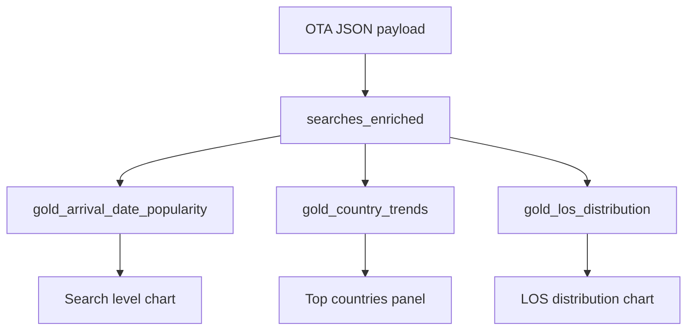

# 2. Per-City Trend Exposure

**Case requirement:** *The application exposes the following trends per city: popularity of arrival date, country from which the user searched from, and length of stay.*

This document maps each Market Insight dashboard chart to its data model, API response, and dbt gold table.

---

## Market Insight dashboard (from case mockup)

The PDF mockup shows three panels for "Searches in the last 7 days":

1. **Search level** — time-series bar chart of search volume over time (by arrival date)
2. **Top countries searching** — ranked list with % share and average LOS
3. **Length-of-stay** — horizontal bars for LOS1, LOS2, LOS3, LOS4–7, LOS8–14

All metrics are **scoped per city** — the primary dimension for Market Insight.

---

## Trend 1: Popularity of arrival date

### What it shows

How many searches were performed for each **check-in (arrival) date**, aggregated by city and search day. Powers the time-series "search level" chart.

### Gold table

**`gold_arrival_date_popularity`**

| Column | Type | Description |
|---|---|---|
| `city` | STRING | Hotel city (from `dim_hotels` join) |
| `arrival_date` | DATE | Check-in date from payload |
| `search_date` | DATE | Date the search was performed |
| `search_count` | INT | Number of searches |

### dbt model

[`dbt/models/gold/gold_arrival_date_popularity.sql`](../../dbt/models/gold/gold_arrival_date_popularity.sql)

```sql
SELECT city, arrival_date, search_date, COUNT(*) AS search_count
FROM searches_enriched
WHERE city IS NOT NULL
GROUP BY city, arrival_date, search_date
```

### API response field

```json
"arrival_date_popularity": [
  {"arrival_date": "2022-03-01", "search_date": "2022-01-24", "search_count": 42}
]
```

### Endpoint

`GET /cities/{city}/trends/arrival-dates`

---

## Trend 2: Country from which the user searched

### What it shows

Which countries users search from, ranked by volume, with:

- **Percentage of total searches** for that city/day
- **Average length of stay** per country

Matches the mockup panel: "United States 23.4%, Avg. LOS: 5.5".

### Gold table

**`gold_country_trends`**

| Column | Type | Description |
|---|---|---|
| `city` | STRING | Hotel city |
| `search_date` | DATE | Search event date |
| `user_country` | STRING | Country name from payload |
| `user_country_iso` | STRING | ISO-3166 code (normalized in silver) |
| `search_count` | INT | Searches from this country |
| `pct_of_total` | FLOAT | % of city's searches that day |
| `avg_los` | FLOAT | Average length of stay |

### dbt model

[`dbt/models/gold/gold_country_trends.sql`](../../dbt/models/gold/gold_country_trends.sql)

Key logic:

```sql
-- pct_of_total = 100 * country_count / city_total
round(100.0 * cc.search_count / ct.total_searches, 1) AS pct_of_total
```

### API response field

```json
"country_trends": [
  {
    "user_country": "United States",
    "user_country_iso": "US",
    "search_count": 234,
    "pct_of_total": 23.4,
    "avg_los": 5.5
  }
]
```

### Endpoint

`GET /cities/{city}/trends/countries`

### Country normalization (silver layer)

Raw payload contains country **names** (e.g. `"Belgium"`). Silver layer maps to ISO codes via:

- Lookup table in [`dbt/models/silver/searches_enriched.sql`](../../dbt/models/silver/searches_enriched.sql)
- Fallback: first two characters uppercased

---

## Trend 3: Length of stay distribution

### What it shows

Distribution of requested stay lengths, bucketed to match the Market Insight UI:

| Bucket | Meaning | Mockup example |
|---|---|---|
| `1` | LOS1 — 1 night | 41.5% |
| `2` | LOS2 — 2 nights | 23.9% |
| `3` | LOS3 — 3 nights | 13.7% |
| `4-7` | LOS4–7 — 4 to 7 nights | 17.4% |
| `8-14` | LOS8–14 — 8 to 14 nights | 3.6% |

### Gold table

**`gold_los_distribution`**

| Column | Type | Description |
|---|---|---|
| `city` | STRING | Hotel city |
| `search_date` | DATE | Search event date |
| `los_bucket` | STRING | One of: `1`, `2`, `3`, `4-7`, `8-14` |
| `search_count` | INT | Searches in this bucket |
| `pct_of_total` | FLOAT | % of city's searches that day |

### dbt model

[`dbt/models/gold/gold_los_distribution.sql`](../../dbt/models/gold/gold_los_distribution.sql)

`los_bucket` is derived in silver:

```sql
CASE
  WHEN length_of_stay = 1 THEN '1'
  WHEN length_of_stay = 2 THEN '2'
  WHEN length_of_stay = 3 THEN '3'
  WHEN length_of_stay BETWEEN 4 AND 7 THEN '4-7'
  WHEN length_of_stay BETWEEN 8 AND 14 THEN '8-14'
END AS los_bucket
```

### API response field

```json
"los_distribution": [
  {"los_bucket": "1", "search_count": 415, "pct_of_total": 41.5},
  {"los_bucket": "2", "search_count": 239, "pct_of_total": 23.9}
]
```

### Endpoint

`GET /cities/{city}/trends/los-distribution`

---

## City resolution

**`city` is not in the inbound JSON.** It is resolved in the silver layer:

1. Join `hotel_id` → [`dbt/seeds/dim_hotels.csv`](../../dbt/seeds/dim_hotels.csv) (Lighthouse hotel dimension)
2. Fallback: reverse geocoding from lat/long (not implemented in MVP; documented in [assumptions.md](../assumptions.md))

Example mapping:

| hotel_id | city |
|---|---|
| 1235 | New York |
| 1236 | Brussels |

---

## Combined API

All three trends in one call:

```
GET /cities/{city}/trends?from=2022-01-01&to=2022-03-31
```

Implementation: [`services/market_insight_api/main.py`](../../services/market_insight_api/main.py)

---

## Data flow diagram



---

## dbt tests on gold outputs

Defined in [`dbt/models/schema.yml`](../../dbt/models/schema.yml):

- Silver: `unique(dedup_key)`, `not_null(city)`, `accepted_values(los_bucket)`
- Singular: [`dbt/tests/assert_los_consistency.sql`](../../dbt/tests/assert_los_consistency.sql)

Soda checks: [`soda/checks/searches_enriched.yml`](../../soda/checks/searches_enriched.yml)

---

## Verify locally

```bash
python scripts/demo.py
# or
curl http://localhost:8081/cities/New%20York/trends | python -m json.tool
```

Expected: all three trend arrays populated with `search_count`, percentages, and LOS buckets.
