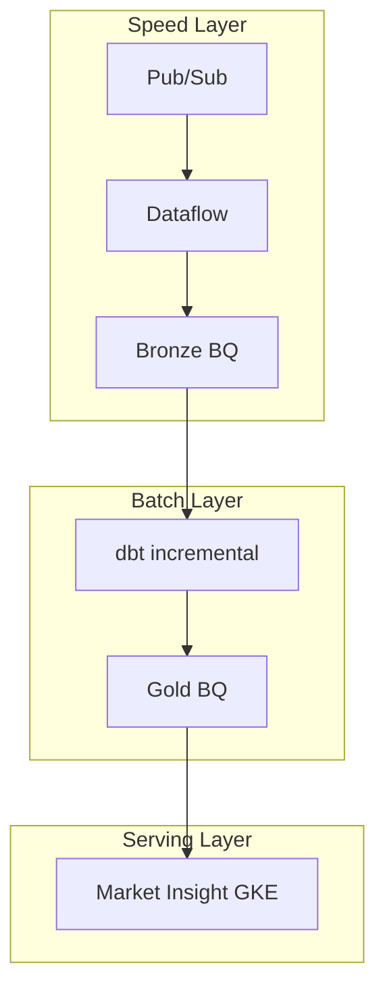

# 3. Architecture Diagram and Technology Choices

**Case requirement:** *Create an architecture diagram for the pipeline, with a focus on the architecture and technologies you would use.*

This document provides the architecture diagram, technology rationale, and mapping to Lighthouse's published stack.

---

## High-level architecture

```mermaid
flowchart LR
  subgraph ingest [Ingestion]
    OTA[OTA Partner]
    LB[Cloud Load Balancer]
    API[Ingestion API on Cloud Run]
    OTA -->|HTTPS POST| LB --> API
  end

  subgraph stream [Streaming Buffer]
    PS[Pub/Sub topic]
    DLQ[Pub/Sub dead-letter topic]
    API -->|publish validated envelope| PS
    API -->|sync reject| DLQ
  end

  subgraph process [Processing]
    DF[Dataflow Python streaming job]
    PS --> DF
    DF -->|invalid| DLQ
    DF -->|valid JSON| GCS[GCS bronze bucket]
    DF -->|valid rows| BQBronze[BigQuery bronze table]
  end

  subgraph transform [Transform and Serve]
    AF[Airflow Composer]
    DBT[dbt models and tests]
    BQSilver[BigQuery silver]
    BQGold[BigQuery gold aggregates]
    SRV[Market Insight API on GKE]
    GCS --> AF
    BQBronze --> AF --> DBT
    DBT --> BQSilver --> BQGold
    BQGold --> SRV
  end

  subgraph ops [Ops and Governance]
    MON[Cloud Monitoring + Grafana]
    SODA[Soda checks + dbt tests]
    ATLAN[Atlan lineage and catalog]
    TF[Terraform state in GCS]
  end
```



Full narrative: [architecture.md](../architecture.md)

---

## Technology stack

Aligned with Lighthouse's published Data Engineering stack (GCP, Python, BigQuery, Airflow, dbt, Terraform, Soda, Atlan, GitLab CI, GKE).

| Layer | Technology | Role | Repo artifact |
|---|---|---|---|
| **Ingestion** | FastAPI on Cloud Run | Receive POST, sync validation, publish to Pub/Sub | [`services/ingestion_api/`](../../services/ingestion_api/) |
| **Buffer** | Google Cloud Pub/Sub | Decouple ingestion from processing; 7-day retention | [`infra/modules/pubsub/`](../../infra/modules/pubsub/) |
| **Streaming landing** | Apache Beam (Python SDK) on Dataflow | Land events to bronze within seconds | [`streaming/bronze_landing.py`](../../streaming/bronze_landing.py) |
| **Raw archive** | Google Cloud Storage | Immutable JSON-lines backup | Terraform GCS bucket in [`infra/environments/dev/main.tf`](../../infra/environments/dev/main.tf) |
| **Data warehouse** | BigQuery (EU) | Bronze, silver, gold tables | [`infra/modules/bigquery/`](../../infra/modules/bigquery/) |
| **Transforms** | dbt | SQL models, tests, documentation | [`dbt/`](../../dbt/) |
| **Orchestration** | Airflow (Composer) + Astronomer Cosmos | Schedule dbt, Soda, partition maintenance | [`airflow/dags/ota_search_pipeline.py`](../../airflow/dags/ota_search_pipeline.py) |
| **Data quality** | Soda Core + dbt tests | Warehouse contract checks | [`soda/`](../../soda/) |
| **Governance** | Atlan | Lineage from dbt manifest | dbt docs → Atlan ingestion |
| **Infrastructure** | Terraform | IaC for all GCP resources | [`infra/`](../../infra/) |
| **CI/CD** | GitLab CI | Plan, test, deploy | [`.gitlab-ci.yml`](../../.gitlab-ci.yml) |
| **Product** | GKE (existing Market Insight) | Serve trends to hoteliers | [`services/market_insight_api/`](../../services/market_insight_api/) (local stand-in) |
| **Observability** | Cloud Monitoring, Grafana/Prometheus | SLIs, alerts, dashboards | Defined in [07_operational_considerations.md](07_operational_considerations.md) |

---

## Why these technologies?

### FastAPI on Cloud Run (ingestion)

- **Python-native** — Lighthouse requires Python for pipeline development
- **Auto-scales** — 100 req/s is trivial; handles bursts to 200 req/s
- **Low ops** — no cluster management; pay per request
- **Fast cold start** — min instances = 1 keeps p99 latency low

### Pub/Sub (buffer)

- Absorbs backpressure without dropping partner requests
- Enables replay if downstream processing fails
- Native DLQ support for poison messages
- Scales to 10,000+ req/s without architecture change

### Dataflow + Apache Beam Python SDK (streaming)

- Lighthouse standard for GCP streaming pipelines
- Flex Templates for repeatable deployments
- Autoscaling workers (2–4 for MVP, 16+ at scale)
- Same Python codebase testable locally with DirectRunner

### BigQuery (warehouse)

- Lighthouse primary data warehouse
- Partition pruning + clustering for cost control
- Native JSON parsing for bronze payloads
- Incremental dbt models on partitioned tables

### dbt (transforms)

- Lighthouse standard for silver/gold modeling
- Declarative tests (`unique`, `not_null`, `accepted_values`)
- Lineage manifest auto-ingested by Atlan
- SQL models are reviewable by Data Products team

### Airflow + Cosmos (orchestration)

- Lighthouse uses Composer for pipeline scheduling
- Cosmos integrates dbt models as Airflow task groups
- Coordinates: Dataflow health → dbt → Soda → partition expiry

### Terraform (IaC)

- Lighthouse IaC standard
- Modular: pubsub, bigquery, cloudrun, dataflow
- GCS remote state with locking per environment

---

## Lambda-inspired layering

Lighthouse describes a Lambda Architecture approach. This design maps cleanly:

| Layer | Component | Freshness | Technology |
|---|---|---|---|
| **Speed** | Bronze landing | Seconds | Dataflow streaming |
| **Batch** | Silver + gold | 15 minutes | Airflow + dbt |
| **Serving** | Product dashboards | On read | Pre-aggregated gold → GKE |



---

## Local vs production mapping

The repo includes a **fully runnable local stack** that mirrors production logic:

| Production (GCP) | Local (demo) |
|---|---|
| Cloud Run FastAPI | Same FastAPI code |
| Pub/Sub | File queue + optional Pub/Sub |
| Dataflow → BigQuery bronze | [`pipeline/bronze_store.py`](../../pipeline/bronze_store.py) |
| dbt silver/gold | [`pipeline/transforms.py`](../../pipeline/transforms.py) (DuckDB) |
| GKE Market Insight | [`services/market_insight_api/`](../../services/market_insight_api/) |

---

## Deployment topology (EU)

All resources in **`europe-west1`** / BigQuery **EU** location for GDPR data residency.

```
europe-west1
├── Cloud Run (ingestion-api)
├── Pub/Sub (ota-searches, ota-searches-dlq)
├── Dataflow job (bronze-landing)
├── GCS (ota-bronze bucket)
├── BigQuery EU
│   ├── ota_bronze.raw_ota_searches
│   ├── ota_silver.searches_enriched
│   └── ota_gold.*
├── Composer 2 (Airflow)
└── GKE (Market Insight — existing cluster)
```

---

## MVP phasing

| Phase | Components added | Timeline |
|---|---|---|
| **Phase 1** | FastAPI → Pub/Sub → GCS → BQ load → dbt → Market Insight | 2–4 weeks |
| **Phase 2** | Dataflow streaming, DLQ, Soda monitoring | +2 weeks |
| **Phase 3** | Atlan lineage, multi-partner schema registry, CUD | Ongoing |

Phase 1 skips Dataflow and Composer (~$450/mo savings) — acceptable for 100 req/s MVP.

---

## Related documents

- [01_receive_store_expose.md](01_receive_store_expose.md) — receive/store/expose detail
- [05_infrastructure_provisioning.md](05_infrastructure_provisioning.md) — Terraform modules
- [assumptions.md](../assumptions.md) — design assumptions
