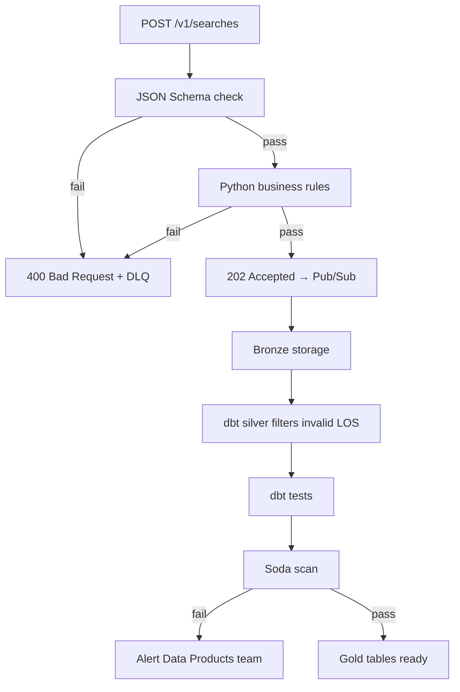

# 4. Data Validation Method

**Case requirement:** *Devise and provide a method for validating the incoming data. You can use any language or technology you are comfortable with.*

This document describes the three-layer validation strategy with runnable code references.

---

## Validation philosophy

Validation is split across three layers, each with a different scope and latency budget:

| Layer | Where | Latency | Catches |
|---|---|---|---|
| **1. Edge (sync)** | Ingestion API | < 10 ms | Schema, types, obvious business rule violations |
| **2. Warehouse (batch)** | dbt silver models | Every 15 min | City resolution, dedup, LOS consistency |
| **3. Monitoring (batch)** | Soda + dbt tests | After each dbt run | Anomalies, null rates, duplicate keys |

**Principle:** Fail fast at the edge for partner-actionable errors. Deep validation in the warehouse for data quality the product depends on.

---

## Layer 1 — JSON Schema (structural validation)

### Purpose

Reject malformed payloads before they enter the pipeline. Uses JSON Schema Draft 2020-12.

### Artifact

[`schemas/ota_search_v1.json`](../../schemas/ota_search_v1.json)

### Rules enforced

| Field | Constraint |
|---|---|
| All top-level fields | Required (10 fields) |
| `arrival_date`, `departure_date` | `format: date` (YYYY-MM-DD) |
| `timestamp` | `format: date-time` (ISO 8601) |
| `length_of_stay` | Integer, 1–365 |
| `hotel_latitude` | Number, -90 to 90 |
| `hotel_longitude` | Number, -180 to 180 |
| `search_results` | Array, min 1 item |
| `search_results[].price` | Number, > 0 |
| `search_results[].currency` | String, pattern `^[A-Z]{3}$` |
| Unknown fields | Allowed (`additionalProperties: true`) for forward compatibility |

### Example valid payload

```json
{
  "arrival_date": "2022-03-01",
  "departure_date": "2022-03-05",
  "length_of_stay": 4,
  "user_country": "Belgium",
  "hotel_id": 1235,
  "hotel_name": "Holiday Inn Manhattan",
  "hotel_latitude": 40.70825421355257,
  "hotel_longitude": -74.0142071188057,
  "timestamp": "2022-01-24T11:01:12",
  "search_results": [
    {"room_name": "Deluxe Suite", "price": 124, "currency": "USD"}
  ]
}
```

---

## Layer 2 — Python validator (business rules)

### Purpose

Enforce domain-specific rules that JSON Schema cannot express. This is the **primary code deliverable** for the case.

### Artifact

[`validation/validate_search_event.py`](../../validation/validate_search_event.py)

### API

```python
def validate_event(payload: dict) -> list[str]:
    """Returns list of error messages. Empty list = valid."""

def is_valid(payload: dict) -> bool:
    """Returns True if payload passes all checks."""
```

### Business rules

| Rule | Error example |
|---|---|
| JSON Schema compliance | `hotel_id: '1235' is not of type 'integer'` |
| `departure_date` > `arrival_date` | `departure_date: must be after arrival_date` |
| `length_of_stay` = date difference | `length_of_stay: expected 4 based on dates, got 3` |
| `user_country` in known list | `user_country: unknown country 'Narnia'` |
| `price` > 0 for each room | `search_results[0].price: must be positive` |
| `currency` in allowed set | `search_results[0].currency: unsupported currency 'XYZ'` |

**LOS convention:** `length_of_stay` is the number of **nights**, not inclusive calendar days. For `2022-03-01` → `2022-03-05`, the partner sends `4` (nights on Mar 1–4; Mar 5 is checkout). Counting Mar 1 through Mar 5 inclusive would be 5 — that is not the partner's definition. Validation uses `(departure_date − arrival_date).days`.

### Known countries (MVP)

Belgium, Brazil, France, Germany, Netherlands, Spain, Switzerland, United Kingdom, United States/USA.

Production: replace with ISO-3166 reference table or geonames API.

### Allowed currencies (MVP)

EUR, USD, GBP, CHF, BRL (ISO 4217 subset).

### Integration in ingestion API

[`services/ingestion_api/main.py`](../../services/ingestion_api/main.py) calls `validate_event()` on every POST:

```python
errors = validate_event(payload)
if errors:
    write_to_dlq("validation_failed", payload)
    return JSONResponse(status_code=400, content={"status": "rejected", "errors": errors})
```

Invalid events are also written to the DLQ directory (`data/dlq/`) for audit.

---

## Layer 3 — Warehouse validation (dbt + Soda)

### dbt tests

Defined in [`dbt/models/schema.yml`](../../dbt/models/schema.yml):

| Test | Model | Column | Severity |
|---|---|---|---|
| `unique` | searches_enriched | dedup_key | error |
| `not_null` | searches_enriched | dedup_key | error |
| `not_null` | searches_enriched | city | warn |
| `accepted_values` | searches_enriched | los_bucket | error |

### Singular test — LOS consistency

[`dbt/tests/assert_los_consistency.sql`](../../dbt/tests/assert_los_consistency.sql)

Returns rows where `length_of_stay != (departure_date - arrival_date)`. Test passes if zero rows returned.

### Soda checks

[`soda/checks/searches_enriched.yml`](../../soda/checks/searches_enriched.yml)

| Check | Threshold |
|---|---|
| Row count > 0 | Must have data |
| Missing city rate | < 1% null |
| Duplicate dedup_key | 0 duplicates |
| Valid los_bucket values | Must be in allowed set |
| Valid pct_of_total | No null percentages in gold |

Configuration: [`soda/configuration.yml`](../../soda/configuration.yml)

Triggered by Airflow after each dbt run ([`airflow/dags/ota_search_pipeline.py`](../../airflow/dags/ota_search_pipeline.py)).

---

## Validation flow diagram



---

## Unit tests

[`validation/test_validate_search_event.py`](../../validation/test_validate_search_event.py) — **12 tests**, all passing:

| Test | Scenario |
|---|---|
| `test_valid_payload_passes` | Happy path from PDF example |
| `test_missing_required_field` | Missing `hotel_id` |
| `test_empty_search_results` | Empty array |
| `test_invalid_latitude` | lat = 95 |
| `test_invalid_longitude` | lon = 200 |
| `test_invalid_date_format` | Wrong date format |
| `test_los_mismatch` | LOS ≠ date difference |
| `test_departure_before_arrival` | Invalid date range |
| `test_unknown_country` | Unknown country name |
| `test_invalid_currency` | XYZ currency |
| `test_zero_price` | price = 0 |
| `test_negative_price` | price = -10 |

### Run tests

```bash
pip install -r requirements.txt
pytest validation/ -v
```

---

## Integration tests

[`tests/test_integration.py`](../../tests/test_integration.py) validates the full path:

- Bronze → silver → gold pipeline produces correct gold rows
- Dedup: same event ingested twice → 1 silver row
- Ingestion API returns 202 for valid, 400 for invalid
- Market Insight API returns all three trend arrays

```bash
pytest tests/test_integration.py -v
```

---

## Schema evolution strategy

| Scenario | Handling |
|---|---|
| Partner adds optional field | Allowed (`additionalProperties: true`); stored in bronze JSON |
| Partner adds required field | New schema version `v2`; dual-write period |
| Partner changes field type | Breaking change; reject at edge with clear error |
| Unknown field in production | Preserved in bronze; added to silver dbt model when needed |

Schema version stamped as Pub/Sub attribute: `schema_version=v1`.

---

## Demo in interview

1. Run `pytest validation/ -v` — show 12 green tests
2. Show `validate_event()` source — explain LOS cross-check
3. POST invalid payload — show `400` with error list
4. Mention dbt tests + Soda as warehouse safety net
