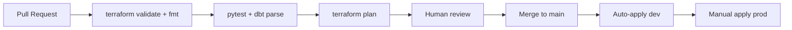

# 5. Infrastructure Provisioning and CI/CD

**Case requirement:** *Lay out your strategy for infrastructure provisioning, resource definition, module usage, state management, applying changes, CI/CD deployment strategy.*

This document covers the full IaC strategy for the OTA search pipeline on GCP.

---

## Repository structure

```
infra/
  modules/
    pubsub/          # Topic, subscription, DLQ, IAM
    bigquery/        # Datasets, tables, partitioning, clustering
    cloudrun/        # Ingestion API service
    dataflow/        # Flex template job
  environments/
    dev/
      main.tf        # Composes modules for dev
      variables.tf
      terraform.tfvars
      backend.tf     # GCS remote state
      outputs.tf
    staging/         # (future)
    prod/            # (future)
```

Also: [`.gitlab-ci.yml`](../../.gitlab-ci.yml) — CI/CD pipeline definition.

---

## Module design

Each Terraform module is self-contained with typed variables, resources, and outputs.

### pubsub module

**Path:** [`infra/modules/pubsub/main.tf`](../../infra/modules/pubsub/main.tf)

| Resource | Purpose |
|---|---|
| `google_pubsub_topic.main` | Primary event stream (`ota-searches`) |
| `google_pubsub_topic.dlq` | Dead-letter topic for failed deliveries |
| `google_pubsub_subscription.main` | Dataflow consumer subscription with DLQ policy |
| IAM bindings | Publisher/subscriber service accounts |

**Outputs:** `topic_id`, `subscription_id`, `dlq_topic_id`

### bigquery module

**Path:** [`infra/modules/bigquery/main.tf`](../../infra/modules/bigquery/main.tf)

| Feature | Detail |
|---|---|
| Datasets | Parameterized map (`ota_bronze`, `ota_silver`, `ota_gold`) |
| Tables | Schema, time partitioning, clustering |
| Bronze TTL | 90-day default partition expiration |
| Location | EU (GDPR) |

**Outputs:** `dataset_ids`, `table_ids`

### cloudrun module

**Path:** [`infra/modules/cloudrun/main.tf`](../../infra/modules/cloudrun/main.tf)

| Setting | Value |
|---|---|
| Min instances | 1 (avoid cold starts) |
| Max instances | Configurable per env (5 dev, 10 prod) |
| Memory | 512 Mi |
| Env vars | `PUBSUB_TOPIC`, `GCP_PROJECT_ID` |
| Service account | Dedicated ingestion SA |

**Outputs:** `service_url`, `service_name`

### dataflow module

**Path:** [`infra/modules/dataflow/main.tf`](../../infra/modules/dataflow/main.tf)

| Setting | Value |
|---|---|
| Job type | Flex Template (`bronze_landing.py`) |
| Workers | 2–4 (configurable) |
| Machine type | n1-standard-2 |
| Service account | Dedicated Dataflow SA |

**Outputs:** `job_id`

---

## Environment composition (dev)

**Path:** [`infra/environments/dev/main.tf`](../../infra/environments/dev/main.tf)

Wires modules together:

```hcl
module "pubsub"       { source = "../../modules/pubsub" }
module "bigquery"     { source = "../../modules/bigquery" }
module "cloudrun_ingestion" { source = "../../modules/cloudrun" }
# + service accounts, GCS buckets, IAM bindings
```

### Service accounts and IAM

| Service account | Roles |
|---|---|
| `ota-ingestion-sa` | `roles/pubsub.publisher` |
| `ota-dataflow-sa` | `roles/bigquery.dataEditor`, `roles/storage.objectAdmin`, `roles/pubsub.subscriber` |

Principle of least privilege — ingestion SA cannot write to BigQuery; Dataflow SA cannot publish to Pub/Sub.

---

## State management

**Path:** [`infra/environments/dev/backend.tf`](../../infra/environments/dev/backend.tf)

```hcl
terraform {
  backend "gcs" {
    bucket = "lighthouse-dev-tf-state"
    prefix = "ota-search/dev"
  }
}
```

| Aspect | Strategy |
|---|---|
| **Backend** | GCS bucket per environment with versioning enabled |
| **Prefix** | `ota-search/{env}` isolates state per pipeline |
| **Locking** | GCS native state locking prevents concurrent applies |
| **Versioning** | Bucket versioning enabled for state rollback |
| **Drift detection** | Weekly scheduled `terraform plan` in GitLab CI |

### State per environment

| Environment | Bucket | Prefix |
|---|---|---|
| dev | `lighthouse-dev-tf-state` | `ota-search/dev` |
| staging | `lighthouse-staging-tf-state` | `ota-search/staging` |
| prod | `lighthouse-prod-tf-state` | `ota-search/prod` |

---

## Applying changes

| Environment | Trigger | Approval | Rollback |
|---|---|---|---|
| **dev** | Merge to `main` | Auto-apply | Revert commit + apply |
| **staging** | Merge to `main` | Manual approval | Previous tfplan |
| **prod** | Tagged release | Manual + second reviewer | GCS state version restore |

### Change workflow



---

## CI/CD pipeline (GitLab CI)

**Path:** [`.gitlab-ci.yml`](../../.gitlab-ci.yml)

### Stages

| Stage | Jobs | Purpose |
|---|---|---|
| **validate** | `terraform_validate` | `terraform fmt -check`, `terraform validate` |
| **test** | `pytest`, `dbt_parse` | Validation tests + dbt project parse |
| **plan** | `terraform_plan` | Generate plan artifact on every PR |
| **deploy** | `terraform_apply_dev` | Manual apply to dev from plan artifact |

### pytest job

```yaml
.pytest:
  stage: test
  image: python:3.12
  script:
    - pip install -r requirements.txt
    - pytest validation/ tests/ -v
```

### Separate deployment pipelines

| Pipeline | Trigger | Deploys |
|---|---|---|
| **Infra** | Terraform plan/apply | Pub/Sub, BQ, Cloud Run, Dataflow |
| **Ingestion service** | Docker build on tag | Cloud Run image |
| **dbt** | Airflow Cosmos DAG | Silver/gold models |

---

## Deployment order

First-time setup sequence:

1. **Terraform:** Create Pub/Sub topics, BigQuery datasets, GCS buckets, service accounts
2. **Docker build:** Build and push ingestion API image to GCR/Artifact Registry
3. **Terraform:** Deploy Cloud Run service (references image URL)
4. **Dataflow:** Build Flex Template from [`streaming/bronze_landing.py`](../../streaming/bronze_landing.py); deploy job
5. **Airflow:** Upload DAG to Composer; configure Cosmos dbt connection
6. **dbt:** Run initial full-refresh of silver/gold models
7. **Soda:** Configure scans; verify checks pass
8. **Atlan:** Ingest dbt manifest for lineage

---

## Resource sizing (dev vs prod)

| Resource | Dev | Prod |
|---|---|---|
| Cloud Run max instances | 5 | 10 |
| Dataflow workers | 2 | 4 |
| Composer environment | Skipped (Cloud Scheduler) | Small Composer 2 |
| BigQuery bronze TTL | 30 days | 90 days |
| Pub/Sub retention | 7 days | 7 days |

---

## Secrets management

| Secret | Storage | Access |
|---|---|---|
| Partner API keys | Secret Manager | Ingestion Cloud Run SA |
| dbt service account | Secret Manager | Composer / Cloud Run |
| Soda API keys | Secret Manager | Airflow Soda task |
| Terraform state | GCS (encrypted at rest) | CI/CD SA only |

Never commit secrets to git. Use `terraform.tfvars` locally (gitignored) or GitLab CI variables.

---

## Related documents

- [03_architecture_and_technologies.md](03_architecture_and_technologies.md) — technology choices
- [06_monthly_cost_estimate.md](06_monthly_cost_estimate.md) — infra cost breakdown
- [iac_strategy.md](../iac_strategy.md) — summary version
