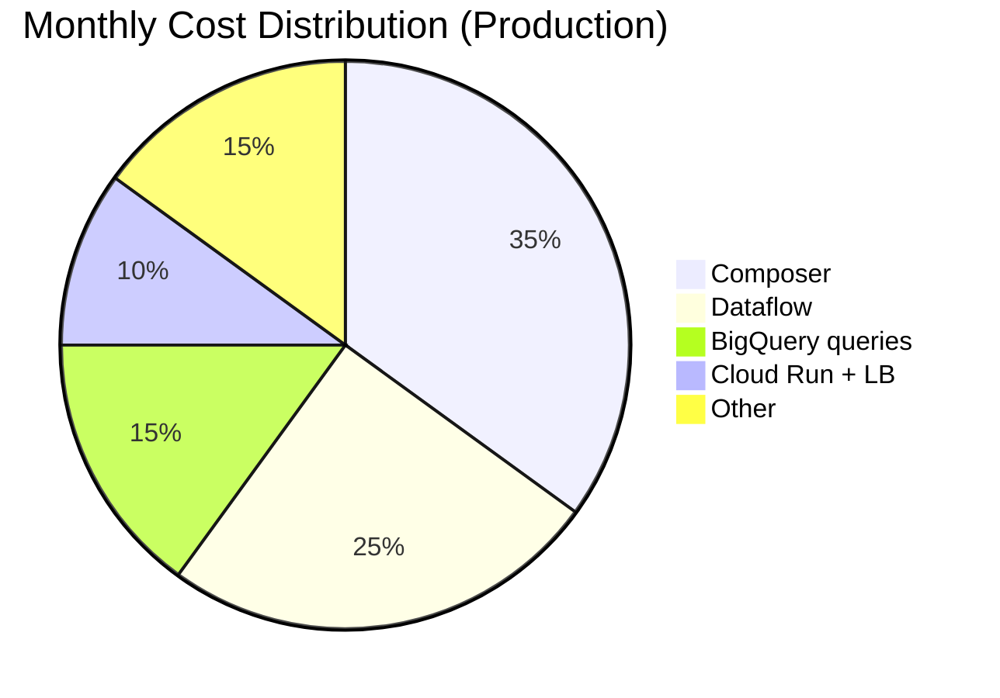

# 6. Monthly Cost Estimate

**Case requirement:** *Give a rough estimation of the monthly costs for the entire pipeline and its infrastructure, explaining any potential cost reduction strategies.*

This document provides a detailed cost breakdown for the OTA search pipeline in production (EU region).

---

## Assumptions

| Parameter | Value |
|---|---|
| Throughput | 100 req/s sustained (~8.6M events/day) |
| Payload size | ~1 KB per event |
| Raw volume | ~260 GB/month ingested |
| Dashboard queries | Moderate (gold tables only) |
| OTA partners | 1 (MVP) |
| Region | `europe-west1`, BigQuery EU |
| Orchestration | Cloud Composer 2 (small) in production |

---

## Monthly cost breakdown (production)

| Component | Estimate (USD/mo) | Calculation basis |
|---|---|---|
| **Cloud Run (ingestion API)** | $30–80 | 1 min instance; ~8.6M requests/mo; 512 Mi RAM; ~100 ms avg |
| **Cloud Load Balancer** | $20–40 | 1 forwarding rule + ingress processing |
| **Pub/Sub** | $5–15 | ~260 GB/month message volume; $40/TiB publish + $40/TiB subscribe |
| **Dataflow streaming** | $150–400 | 2–4 n1-standard-2 workers, 24/7; vCPU + RAM + shuffle |
| **BigQuery storage** | $5–20 | ~260 GB bronze + ~5 GB gold; active storage $0.02/GB/mo |
| **BigQuery queries** | $50–200 | dbt runs every 15 min + dashboard queries on gold; $6.25/TiB scanned |
| **GCS bronze archive** | $5–10 | Standard → Nearline after 30 days; lifecycle policy |
| **Cloud Composer 2 (small)** | $300–500 | Largest fixed cost; 3-node environment |
| **GKE (Market Insight)** | $0 incremental | Shared existing cluster; marginal BQ query cost only |
| **Cloud Monitoring / Logging** | $20–50 | Log volume; sampling recommended |
| **Secret Manager** | $1–5 | API keys, service account JSON |
| **Total** | **~$650–1,500/mo** | |

---

## Cost drivers



1. **Cloud Composer (~30–40%)** — fixed cost regardless of data volume
2. **Dataflow streaming (~20–30%)** — always-on workers for real-time bronze landing
3. **BigQuery queries (~10–15%)** — scales with dbt frequency and dashboard usage

At 100 req/s, **orchestration and streaming dominate** — not storage or ingestion.

---

## Detailed calculations

### Ingestion (Cloud Run + LB)

```
Requests/month  = 100 req/s × 86,400 s/day × 30 days ≈ 259M
Cloud Run cost  ≈ 259M × $0.0000004/request + 1 min instance × $0.00002400/vCPU-s
                ≈ $30–80/month
Load Balancer   ≈ $18 base + $0.008/GB processed ≈ $20–40/month
```

### Pub/Sub

```
Volume/month    = 259M messages × 1 KB ≈ 260 GB
Publish cost    = 0.26 TiB × $40/TiB ≈ $10
Subscribe cost  = 0.26 TiB × $40/TiB ≈ $10
Total           ≈ $5–15/month (with free tier offset)
```

### Dataflow

```
Workers         = 2–4 n1-standard-2 (2 vCPU, 7.5 GB RAM)
Cost/worker/hr  ≈ $0.07–0.14
Monthly         = 2 workers × $0.10/hr × 730 hrs ≈ $150
                  4 workers × $0.10/hr × 730 hrs ≈ $400
```

### BigQuery

```
Storage         = 265 GB × $0.02/GB ≈ $5/month
dbt scans       = ~50 runs/day × 1 GB scan × 30 days × $6.25/TiB ≈ $10/month
Dashboard scans = depends on usage; gold is ~5 GB total ≈ $50–200/month
```

---

## Cost reduction strategies

| # | Strategy | Monthly savings | Trade-off |
|---|---|---|---|
| 1 | **Batch-only MVP** — skip Dataflow; micro-batch load every 5 min | $150–400 | 5 min freshness instead of seconds |
| 2 | **Drop Composer in dev/staging** — Cloud Scheduler + Cloud Run for dbt | $300/env | No Airflow UI in non-prod |
| 3 | **BigQuery partition TTL** — expire bronze after 90 days | Prevents unbounded storage growth | Cannot reprocess data older than TTL |
| 4 | **Pre-aggregate in gold** — never scan bronze for dashboards | Query cost stays flat as volume grows | More dbt model maintenance |
| 5 | **Right-size Dataflow** — start 2 workers, autoscale to 4 | $75–150 | May lag during traffic spikes |
| 6 | **Committed use discounts (CUD)** — 1-yr Dataflow/Compute commitment | 20–30% on compute | Upfront commitment; less flexibility |
| 7 | **Cloud Workflows instead of Composer** — simpler orchestration | ~$300 | Less mature dbt integration; no Airflow UI |
| 8 | **Log sampling** — reduce Cloud Logging volume | $10–30 | Less debug detail in logs |

---

## MVP vs production cost

| Phase | Components | Est. monthly cost |
|---|---|---|
| **Phase 1 (MVP)** | FastAPI → Pub/Sub → GCS → scheduled BQ load → dbt (Cloud Scheduler) | **$200–400** |
| **Phase 2 (streaming)** | Add Dataflow + Composer | **$500–900** |
| **Phase 3 (production)** | Full stack + monitoring + multi-env | **$650–1,500** |

Phase 1 is sufficient for 100 req/s and proves the pipeline before committing to always-on streaming costs.

---

## Scaling projection (10× volume)

At **1,000 req/s** (2.6 TB/month):

| Component | Impact | Est. cost |
|---|---|---|
| Cloud Run | Linear autoscaling | ~$300/mo |
| Pub/Sub | Linear | ~$50/mo |
| Dataflow | Linear (8–16 workers) | ~$1,500/mo |
| BigQuery storage | Linear | ~$50/mo |
| BigQuery queries | Sub-linear (gold pre-aggregation) | ~$200/mo |
| Composer | Fixed | ~$500/mo |
| **Total** | | **~$2,500–4,000/mo** |

Pre-aggregated gold tables and partition pruning are critical to keep query costs sub-linear.

---

## Cost monitoring

| Alert | Threshold | Action |
|---|---|---|
| BigQuery daily scan | > 500 GB/day | Review dbt incremental models |
| Dataflow worker hours | > 3,000 hrs/mo | Right-size or switch to batch |
| Cloud Run instance count | > 8 sustained | Review rate limits / partner traffic |
| Total monthly spend | > $2,000 | Architecture review |

Set up billing budgets in GCP with alerts at 50%, 80%, 100% of monthly target.

---

## Summary for interview

> "At 100 req/s and 260 GB/month, I estimate **$650–1,500/month** for the full production stack in EU. The biggest costs are Composer and Dataflow — both fixed/overhead costs that aren't strictly necessary at this volume. I'd start with an **MVP at $200–400/month** using batch loading and Cloud Scheduler, then add streaming when freshness requirements or volume justify it."

---

## Related documents

- [03_architecture_and_technologies.md](03_architecture_and_technologies.md) — MVP phasing
- [05_infrastructure_provisioning.md](05_infrastructure_provisioning.md) — resource sizing
- [cost_estimate.md](../cost_estimate.md) — summary version
