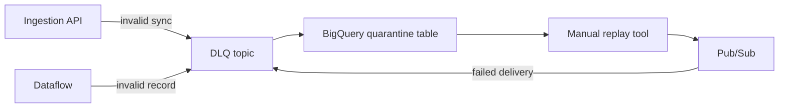

# 7. Operational Considerations

**Case requirement:** *In your design, consider all aspects that could impact the success and efficiency of the pipeline, including but not limited to data quality & governance, data privacy, system performance, and error handling.*

This document addresses each cross-cutting concern in detail.

---

## 1. Data quality

### Strategy: three-layer validation

See [04_data_validation.md](04_data_validation.md) for full detail.

| Layer | Tool | Frequency | Action on failure |
|---|---|---|---|
| Edge | JSON Schema + Python | Every request | 400 to partner; DLQ audit |
| Warehouse | dbt tests | Every 15 min | Block gold refresh |
| Monitoring | Soda Core | After dbt run | Alert + dashboard flag |

### Key quality metrics (SLIs)

| Metric | Target | Alert threshold |
|---|---|---|
| Validation error rate | < 0.5% | > 1% for 10 min |
| Null city rate (silver) | < 0.1% | > 1% |
| Duplicate dedup_key | 0 | > 0 |
| dbt test pass rate | 100% | Any failure |
| Soda scan pass rate | 100% | Any failure |

### Data quality incident response

1. Soda/dbt alert fires → gold refresh blocked automatically
2. Data Products engineer investigates silver layer
3. If partner data issue → contact partner with sample bad records from DLQ
4. If pipeline bug → fix, backfill from bronze (90-day window)
5. Post-incident: add dbt test or Soda check to prevent recurrence

---

## 2. Data governance

### Atlan integration

| Capability | How |
|---|---|
| **Lineage** | dbt manifest auto-ingested; graph: bronze → silver → gold → Market Insight |
| **Catalog** | Column descriptions from dbt docs |
| **Ownership** | Data Products team owns silver/gold; Integrations team owns bronze |
| **Classification** | Tag datasets: `non-PII`, `partner-confidential`, `EU-residency` |

### Schema registry

| Version | Status | Notes |
|---|---|---|
| `v1` | Active | Current payload schema ([`schemas/ota_search_v1.json`](../../schemas/ota_search_v1.json)) |
| `v2+` | Future | Dual-write period; version in Pub/Sub attributes |

### Access control

| Role | Bronze | Silver | Gold | Ingestion API |
|---|---|---|---|---|
| Data Platform | Read/Write | Read | Read | Admin |
| Data Products | Read | Read/Write | Read/Write | — |
| Product Engineering | — | — | Read | — |
| OTA Partner | — | — | — | Write (API key) |

BigQuery IAM + column-level security on any future PII fields.

---

## 3. Data privacy (GDPR)

### Current payload assessment

The OTA payload contains **no direct PII**:

- No user ID, email, IP address, or device fingerprint
- Only: country name, hotel search parameters, room prices

### Privacy controls

| Control | Implementation |
|---|---|
| **Data minimization** | Product API exposes city-level aggregates only; no event-level data |
| **EU data residency** | All GCP resources in `europe-west1`; BigQuery location = EU |
| **Retention limits** | Bronze TTL 90 days; gold retained (aggregated, non-PII) |
| **Partner DPA** | Data Processing Agreement with OTA partner before go-live |
| **Right to erasure** | Not applicable at aggregate level; bronze TTL handles raw data |

### Future PII scenario

If partner adds `user_segment` or `device_id`:

1. Privacy review required before acceptance
2. Store in bronze only — exclude from silver/gold
3. Update Atlan classification tags
4. Never expose in Market Insight API
5. Document in schema registry with `PII` flag

---

## 4. System performance

### Throughput requirements

| Metric | Requirement | Design headroom |
|---|---|---|
| Ingestion | 100 req/s sustained | Cloud Run scales to 1000+ req/s |
| Burst | 200 req/s for 5 min | Pub/Sub absorbs without drops |
| End-to-end freshness | < 20 min | 15 min dbt schedule |
| API read latency | < 500 ms p95 | Pre-aggregated gold (~5 GB total) |

### Performance optimizations

| Optimization | Layer | Impact |
|---|---|---|
| **Partition pruning** | BigQuery bronze | dbt scans only new partitions |
| **Incremental dbt models** | Silver | Process only new bronze rows since last run |
| **Pre-aggregated gold** | Gold | Dashboard queries scan ~5 GB, not 260 GB bronze |
| **Clustering** | Bronze (`hotel_id`) | Faster joins in silver |
| **Dataflow autoscaling** | Streaming | Scale workers on backlog |
| **Cloud Run min instances = 1** | Ingestion | Avoid cold start latency |

### Performance SLIs

| SLI | Target | Measurement |
|---|---|---|
| Ingestion API p99 latency | < 200 ms | Cloud Monitoring |
| Dataflow watermark age | < 60 s | Dataflow metrics |
| dbt run duration | < 5 min | Airflow task duration |
| Gold → API p95 | < 500 ms | GKE / Cloud Run metrics |

### Scaling to 10,000 req/s

| Component | Action |
|---|---|
| Cloud Run | Increase max instances to 100+ |
| Pub/Sub | No change (handles natively) |
| Dataflow | 16–32 workers; regional subscriptions |
| BigQuery | Streaming inserts or larger micro-batches |
| dbt | Increase frequency or materialized views for gold |
| Composer | Medium environment |

---

## 5. Error handling

### Error categories and responses

| Error | Layer | Handling | Recovery |
|---|---|---|---|
| **Invalid JSON** | Ingestion | 400 to partner; DLQ audit log | Partner fixes payload |
| **Validation failure** | Ingestion | 400 with error list; DLQ | Partner fixes payload |
| **Rate limit exceeded** | Ingestion | 429 Too Many Requests | Partner backs off |
| **Pub/Sub publish failure** | Ingestion | Retry with exponential backoff; alert if sustained | Manual replay from API logs |
| **Dataflow processing error** | Streaming | Message → DLQ after 5 attempts | Replay from DLQ subscription |
| **Unknown hotel_id** | Silver | `city = NULL`; Soda flags if rate > 0.1% | Update dim_hotels; re-run dbt |
| **LOS inconsistency** | Silver | Row filtered out of silver | Partner data quality review |
| **dbt test failure** | Gold | Gold refresh blocked; alert | Fix upstream; re-run dbt |
| **Soda scan failure** | Monitoring | Alert; dashboard shows stale data flag | Investigate silver/gold |
| **Dataflow job down** | Streaming | Airflow health check skips dbt | Restart job; catch up from Pub/Sub backlog |

### Dead-letter queue (DLQ) architecture



| DLQ source | Retention | Review cadence |
|---|---|---|
| Pub/Sub DLQ topic | 7 days | Daily |
| Local `data/dlq/` (dev) | Until manual cleanup | Per test run |
| BigQuery quarantine table | 90 days | Weekly |

### Alerting rules

| Alert | Condition | Severity | Channel |
|---|---|---|---|
| High validation error rate | > 1% for 10 min | Warning | Slack #data-products |
| DLQ message spike | > 100 messages in 5 min | Critical | PagerDuty |
| Dataflow job stopped | Job state != RUNNING | Critical | PagerDuty |
| dbt test failure | Any test fails | Warning | Slack #data-products |
| End-to-end freshness breach | Gold stale > 30 min | Warning | Slack #data-products |
| Ingestion API 5xx rate | > 0.1% for 5 min | Critical | PagerDuty |

### Idempotency and deduplication

Partner may retry POSTs (at-least-once delivery):

```
dedup_key = SHA256(hotel_id | timestamp | user_country | arrival_date)
```

Applied at:
1. **Dataflow bronze landing** — assigns key, writes all events
2. **dbt silver** — `QUALIFY ROW_NUMBER() OVER (PARTITION BY dedup_key ORDER BY ingestion_time DESC) = 1`
3. **DuckDB local pipeline** — same logic in [`pipeline/transforms.py`](../../pipeline/transforms.py)

---

## 6. Observability

### Dashboards (Grafana / Cloud Monitoring)

| Dashboard | Panels |
|---|---|
| **Ingestion** | Request rate, p99 latency, error rate, 4xx/5xx breakdown |
| **Streaming** | Dataflow watermark age, throughput, DLQ rate, worker count |
| **Warehouse** | dbt run duration, rows processed, test pass rate |
| **Product** | API read latency, cities served, cache hit rate |

### Logging strategy

| Service | Log level | Retention |
|---|---|---|
| Ingestion API | INFO (WARN for validation failures) | 30 days |
| Dataflow | INFO | 14 days |
| dbt | INFO | 90 days (Airflow logs) |
| Soda | INFO | 90 days |

Use structured JSON logging with correlation IDs (`event_id`) for end-to-end tracing.

---

## Summary matrix

| Concern | Primary tools | Key artifact |
|---|---|---|
| Data quality | Python validator, dbt tests, Soda | [`validation/`](../../validation/), [`dbt/`](../../dbt/), [`soda/`](../../soda/) |
| Governance | Atlan, dbt docs, schema registry | dbt manifest, [`schemas/`](../../schemas/) |
| Privacy | EU residency, bronze TTL, aggregate-only API | [assumptions.md](../assumptions.md) |
| Performance | Partition pruning, incremental dbt, gold pre-aggregation | [`dbt/models/gold/`](../../dbt/models/gold/) |
| Error handling | DLQ, quarantine table, alerting, dedup | [`streaming/bronze_landing.py`](../../streaming/bronze_landing.py) |

---

## Related documents

- [04_data_validation.md](04_data_validation.md) — validation detail
- [01_receive_store_expose.md](01_receive_store_expose.md) — system design
- [assumptions.md](../assumptions.md) — design assumptions
- [interview_qa.md](../interview_qa.md) — Q&A preparation
