# Lighthouse Data Engineer Case — Presentation

**Duration:** 30 minutes | **Format:** Import into Google Slides or PowerPoint

Visual assets: [`presentation/assets/`](assets/) — 13 PNG charts and diagrams (regenerate with `python scripts/generate_presentation_assets.py`)

---

## Slide 1: Title

**OTA Search Ingestion Pipeline**

Design for Market Insight — Lighthouse Data Engineer Case

Gilles | [Date]

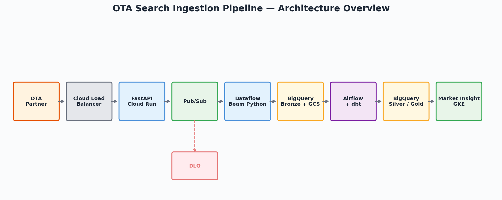

---

## Slide 2: Problem Statement

**Partnership with an OTA** (booking.com, trivago, …)

- Partner sends hotel search events via HTTP POST
- We visualize trends **per city** in Market Insight:
  - Popularity of arrival dates
  - Top searcher countries (% share, avg length of stay)
  - Length-of-stay distribution

**Goal:** Receive → Store → Expose trend data to the product

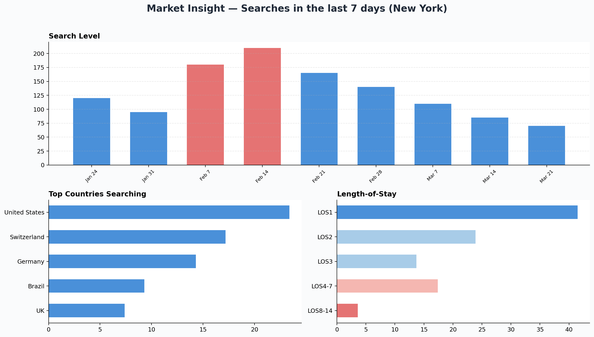

---

## Slide 3: Requirements & Constraints

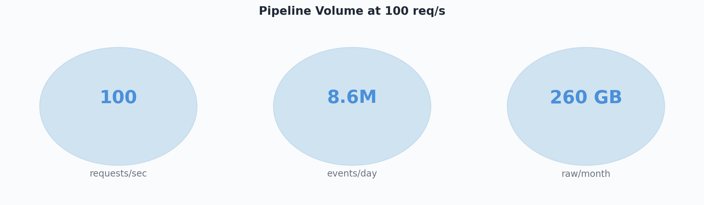

| Constraint | Value |
|---|---|
| Throughput | 100 req/s (~8.6M events/day) |
| Payload | ~1 KB JSON per request |
| Raw volume | ~260 GB/month |
| Freshness | Trends refreshed every 15 min |
| Privacy | No PII in payload; city-level aggregates only |

**Non-functional:** EU data residency, 99.9% ingestion availability, schema evolution support

---

## Slide 4: Key Assumptions

1. **`city` not in payload** → join `hotel_id` to `dim_hotels`
2. **`user_country` is a name** → normalize to ISO-3166 in dbt silver
3. **At-least-once delivery** → dedup on `SHA256(hotel_id|timestamp|country|arrival_date)`
4. **No PII** → aggregate-only product views; bronze TTL 90 days
5. **Market Insight exists on GKE** → gold tables consumed by existing backend
6. **Single partner for MVP** → multi-partner in Phase 3

Full list: `docs/assumptions.md`

---

## Slide 5: Architecture Overview

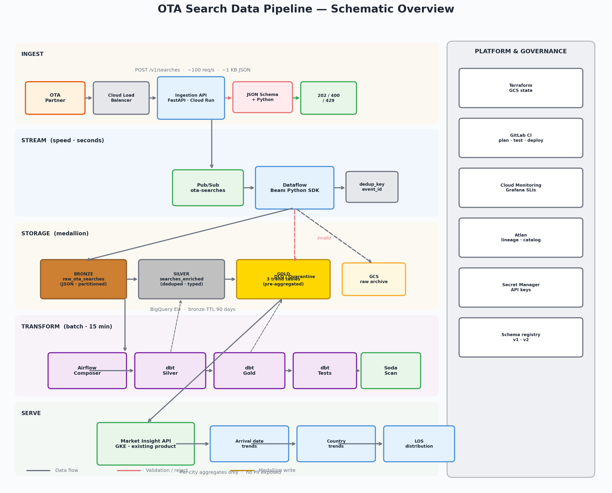


**Lighthouse stack:** GCP, Pub/Sub, BigQuery, Dataflow, Airflow, dbt, Soda, Atlan, Terraform, GitLab CI

See full diagram: `docs/architecture.md`

---

## Slide 6: Ingestion Layer

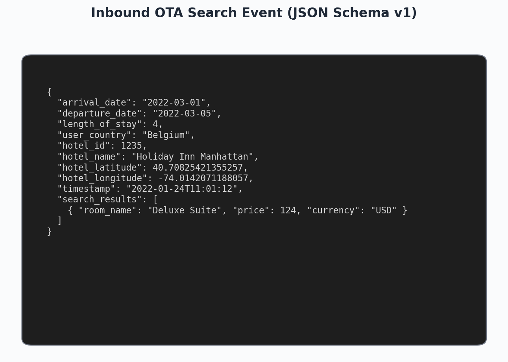

**FastAPI on Cloud Run**

- `POST /v1/searches` with API key + IP allowlist
- Sync validation: JSON Schema + Python business rules
- Response: `202 Accepted` / `400 Bad Request` / `429`
- Publish to Pub/Sub with metadata attributes

**Why Pub/Sub?** Decouples ingestion from storage; enables replay; absorbs backpressure

---

## Slide 7: Streaming Layer (Speed)

**Dataflow — Apache Beam Python SDK**

- Read Pub/Sub → parse JSON → compute `dedup_key` + `event_id`
- Write to BigQuery `raw_ota_searches` (bronze)
- Archive raw JSON to GCS
- Invalid records → DLQ topic

Latency: events land in bronze within **seconds**

---

## Slide 8: Data Model — Medallion

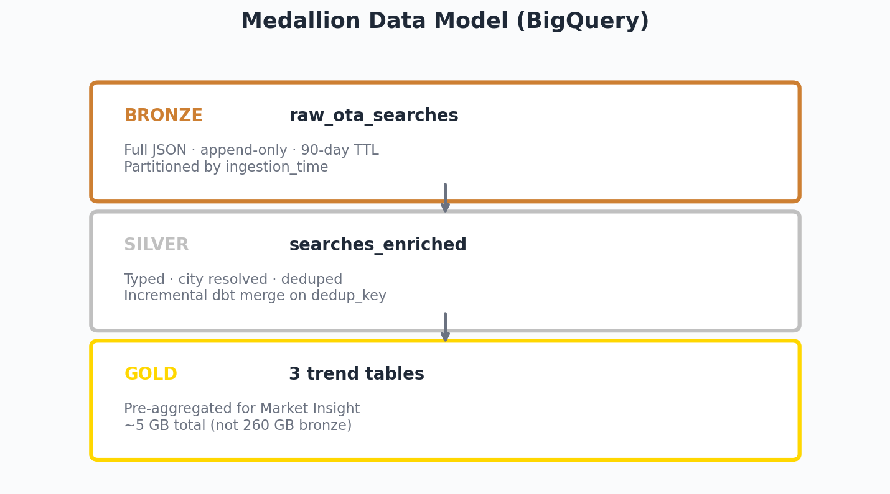

| Layer | Table | Purpose |
|---|---|---|
| **Bronze** | `raw_ota_searches` | Full JSON, append-only, partitioned by day |
| **Silver** | `searches_enriched` | Typed, city resolved, deduped, LOS bucketed |
| **Gold** | 3 trend tables | Pre-aggregated for Market Insight charts |

Partition pruning + incremental dbt models keep costs low

---

## Slide 9: dbt Transforms — Silver

**`searches_enriched`** (incremental, merge on `dedup_key`):

- Parse JSON from bronze
- Join `hotel_id` → city via `dim_hotels`
- Normalize country to ISO-3166
- Validate LOS consistency (filter mismatches)
- Derive `los_bucket`: 1, 2, 3, 4-7, 8-14
- Dedupe on `dedup_key`

Tests: `unique(dedup_key)`, `not_null(city)`, `accepted_values(los_bucket)`

---

## Slide 10: dbt Transforms — Gold

Three models map 1:1 to Market Insight dashboard:

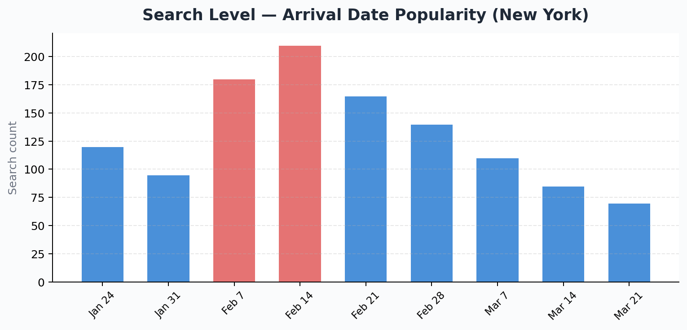

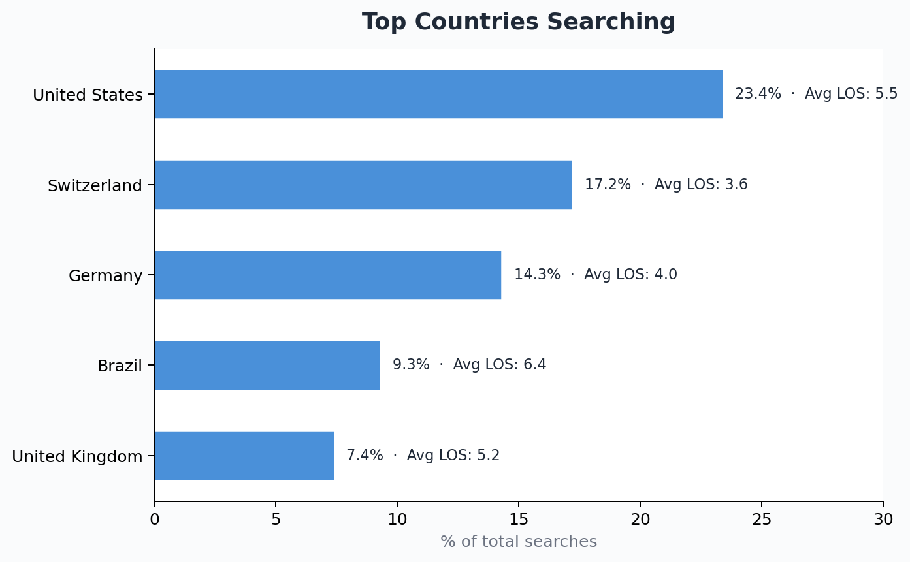

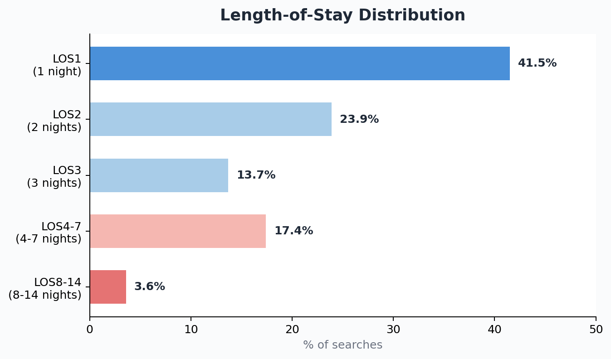

| Model | Chart | Metrics |
|---|---|---|
| `gold_arrival_date_popularity` | Search level (time series) | search_count by arrival_date |
| `gold_country_trends` | Top countries | search_count, pct_of_total, avg_los |
| `gold_los_distribution` | Length of stay | search_count, pct by los_bucket |

Pre-aggregated → dashboard queries scan ~5 GB, not 260 GB

---

## Slide 11: Validation Strategy (3 Layers)

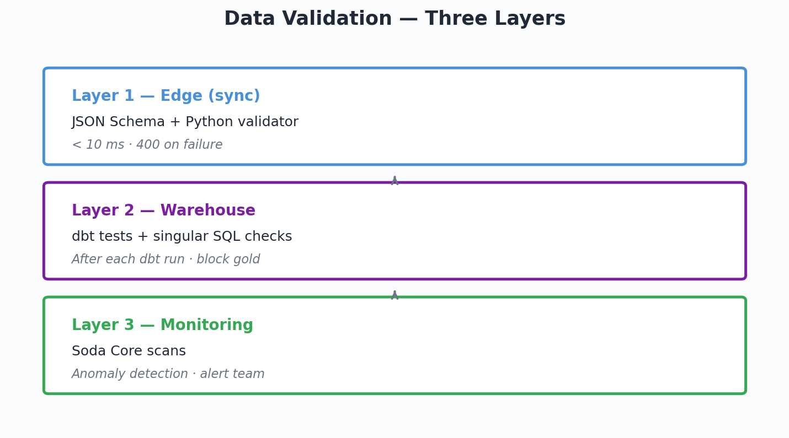

| Layer | Tool | When |
|---|---|---|
| **1. Edge** | JSON Schema + Python validator | Sync at ingestion (< 10 ms) |
| **2. Warehouse** | dbt tests | After each dbt run |
| **3. Monitoring** | Soda Core scans | After dbt, alert on anomalies |

**Demo:** `pytest validation/` — 12 tests, all green

Code: `validation/validate_search_event.py`

---

## Slide 12: Orchestration

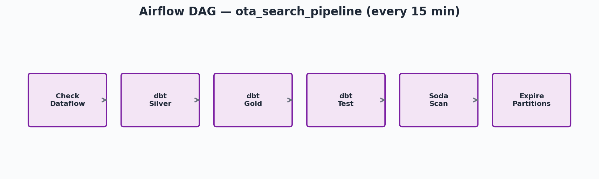

**Airflow (Composer) + Astronomer Cosmos**

DAG schedule: every 15 minutes

MVP alternative: Cloud Scheduler + Cloud Run (~$300/mo cheaper)

---

## Slide 13: Infrastructure & CI/CD

**Terraform** — modular, GCS remote state per environment

```
infra/modules/{pubsub, bigquery, cloudrun}
infra/environments/{dev, staging, prod}
```

**GitLab CI:** validate → test (pytest + dbt) → plan → apply

- PR: `terraform plan` (read-only)
- Merge to main: auto-apply dev
- Prod: manual approval gate

---

## Slide 14: Cost Estimate

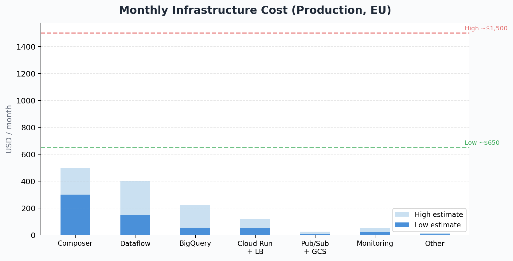

| Component | USD/mo |
|---|---|
| Cloud Run + LB | $50–120 |
| Pub/Sub + GCS | $10–25 |
| Dataflow | $150–400 |
| BigQuery | $55–220 |
| Composer | $300–500 |
| Monitoring | $20–50 |
| **Total** | **$650–1,500** |

**Reduction levers:** batch-only MVP, drop Composer in dev, partition TTL, pre-aggregate gold, CUD

Details: `docs/cost_estimate.md`

---

## Slide 15: Cross-Cutting Concerns

| Topic | Approach |
|---|---|
| **Error handling** | DLQ → quarantine table; alert > 1% error rate |
| **Privacy / GDPR** | No PII; EU region; bronze TTL 90 days; DPA with partner |
| **Governance** | Atlan lineage from dbt manifest; schema registry |
| **Performance** | Partition pruning, incremental models, gold pre-aggregation |
| **Observability** | SLIs: latency p99, freshness, error rate, dbt success |

---

## Slide 16: MVP Phasing

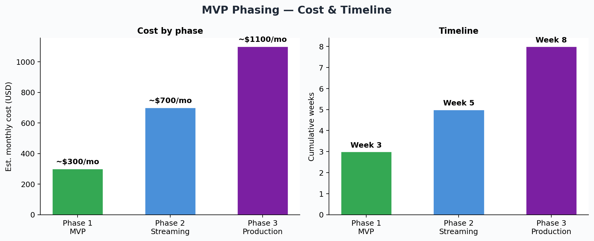

| Phase | Scope | Cost | Timeline |
|---|---|---|---|
| **1 — MVP** | FastAPI → Pub/Sub → GCS → BQ → dbt → Market Insight | ~$200–400/mo | 2–4 weeks |
| **2 — Streaming** | Add Dataflow, DLQ, Soda | ~$500–900/mo | +2 weeks |
| **3 — Production** | Atlan, multi-partner, CUD, autoscaling | ~$650–1,500/mo | Ongoing |

100 req/s does not require maximum complexity on day one

---

## Slide 17: Lambda-Inspired Layering

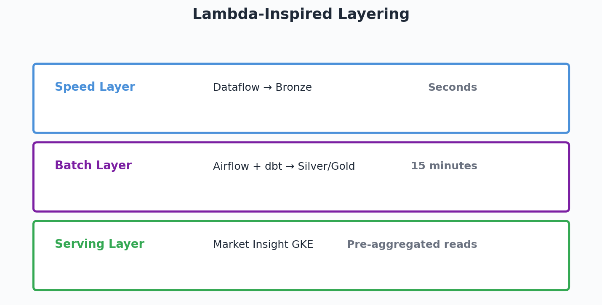

| Layer | Component | Latency |
|---|---|---|
| **Speed** | Dataflow → bronze | Seconds |
| **Batch** | Airflow + dbt → silver/gold | 15 min |
| **Serving** | GKE Market Insight | Pre-aggregated reads |

Matches Lighthouse's published Lambda Architecture approach

---

## Slide 18: Open Questions for Lighthouse

1. Is `dim_hotels` in BigQuery with reliable `hotel_id → city`?
2. What freshness SLA does Market Insight require?
3. Existing partner ingestion pattern to reuse?
4. Does the product query BigQuery directly or via cache?
5. Atlan onboarding workflow for new datasets?

---

## Slide 19: Summary

- **Receive:** FastAPI + Pub/Sub (decoupled, replayable)
- **Store:** Medallion in BigQuery (bronze/silver/gold)
- **Transform:** dbt (testable, lineage-ready)
- **Validate:** 3 layers (Python + dbt + Soda)
- **Expose:** Gold tables → existing Market Insight on GKE
- **Operate:** Terraform + GitLab CI + Airflow + Atlan

**Total cost:** ~$650–1,500/mo production; ~$200–400/mo MVP

---

## Slide 20: Thank You

**Questions?**

Repository: all code, docs, and diagrams included

- `docs/architecture.md` — full design
- `validation/` — runnable Python validator + tests
- `dbt/` — warehouse models
- `infra/` — Terraform modules
- `presentation/assets/` — charts and diagrams
- `docs/interview_qa.md` — Q&A preparation
